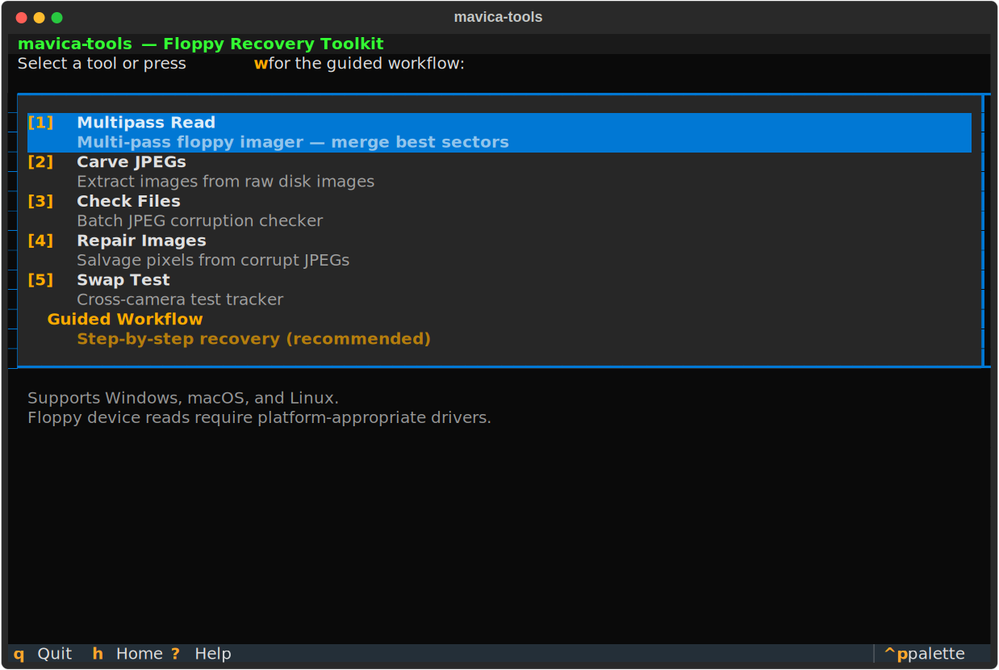
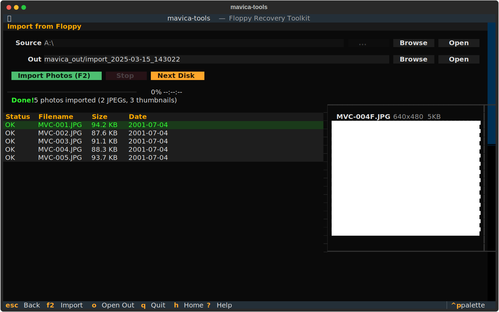
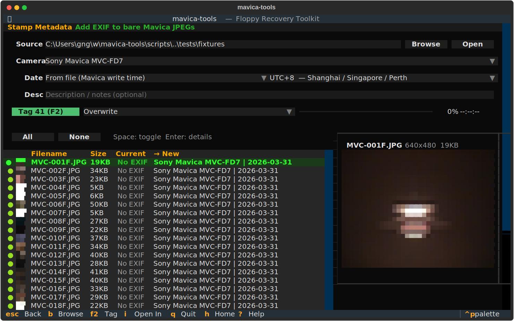
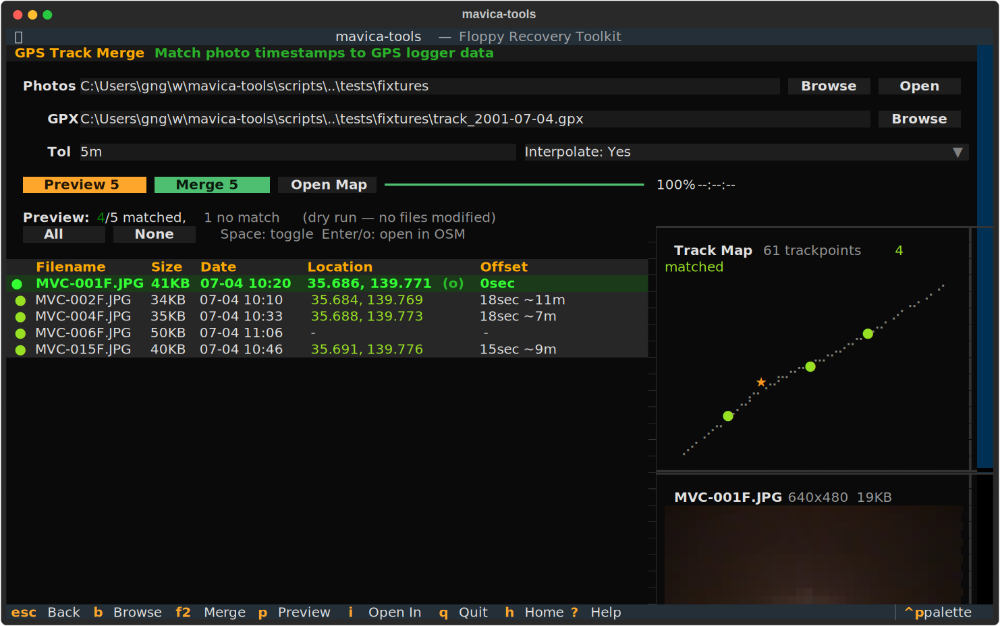
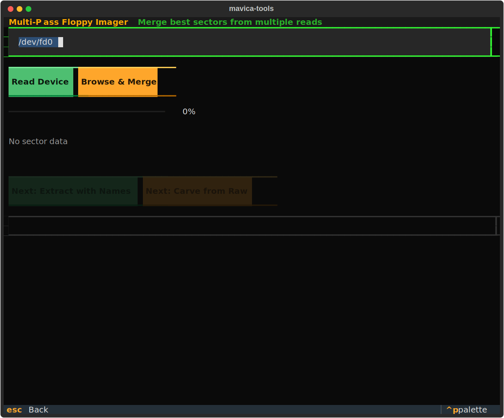
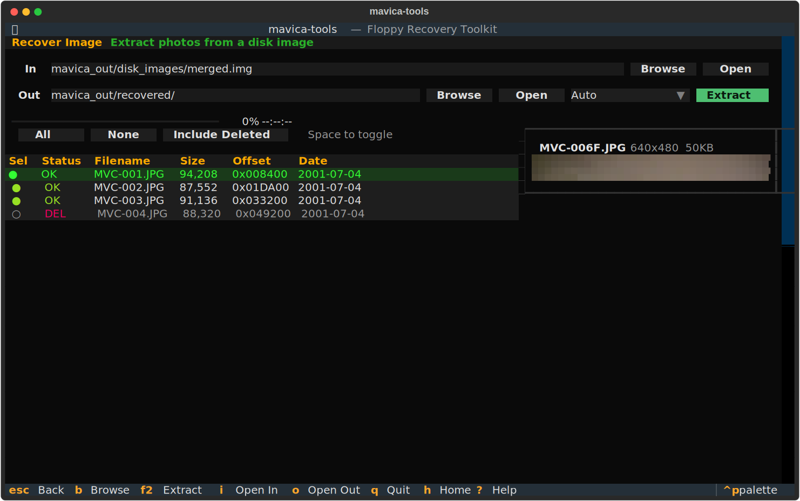
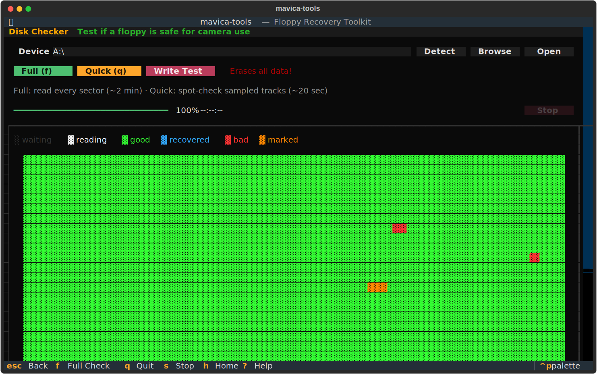
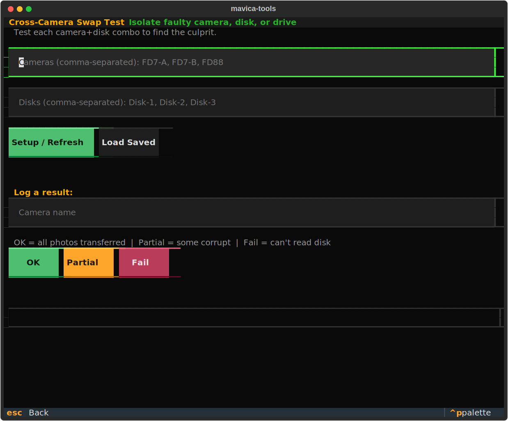

# mavica-tools

Recover photos from Sony Mavica floppy disks. Import, repair, and geotag — via TUI or CLI.

Works on **Windows**, **macOS**, and **Linux**.



## Install

**Download (no Python needed):**

Grab the latest binary from [Releases](https://github.com/gyng/mavica-tools/releases):
- **Windows**: `mavica-tools-windows.zip` — unzip, run `mavica.exe tui`
- **macOS**: `mavica-tools-mac.tar.gz` — extract, run `./mavica tui`
- **Linux**: `mavica-tools-linux.tar.gz` — extract, run `./mavica tui`

**Install via pip/uv (Python 3.10+):**

```bash
pip install mavica-tools        # or: uv tool install mavica-tools
pip install "mavica-tools[gps]" # optional: GPS track merging
```

## Get Started

**Import photos from a floppy:**

```bash
mavica import /mnt/floppy -m fd7 --contact-sheet
mavica tui    # or use the interactive TUI
```

**Recover a damaged disk:**

```bash
mavica recover device /dev/fd0 -o recovery/ -n 5
```

## TUI

```bash
mavica tui
```



**Photos** — Import from Floppy, Tag Photos (EXIF), Add GPS Location, .411 Thumbnails

**Disk** — Test Disk, Format Disk

**Recovery** — Image Disk (multipass), Browse & Recover Image (FAT12 + carve), Check & Repair Photos

<details>
<summary>More screenshots</summary>

**Tag Photos (EXIF metadata)**


**GPS Track Merge** — match photos to GPX tracks with braille track map


**Multi-pass disk reader**


**Browse & Recover Image**


**Disk health check**


**Swap Test matrix**


</details>

## CLI Quick Reference

```bash
mavica import /mnt/floppy -m fd7          # copy photos, add EXIF, contact sheet
mavica recover device /dev/fd0 -n 5       # full recovery pipeline
mavica multipass read /dev/fd0 -n 5       # multi-pass floppy image
mavica check photos/                      # batch corruption scan
mavica repair photos/ -o repaired/        # salvage corrupt JPEGs
```

Run `mavica --help` or `mavica <command> --help` for full options.

## Troubleshooting

See [mavica-floppy-troubleshooting.md](mavica-floppy-troubleshooting.md) for hardware diagnostics: camera vs disk vs drive isolation, head cleaning, swap test methodology, and floppy maintenance.

## Development

```bash
uv sync --extra dev                       # install with dev deps
uv run mavica tui                         # run locally
uv run pytest -v                          # all tests
uv run pytest -k "not tui" -v             # fast unit tests (~1s)
uv run pytest tests/test_tui.py -v        # TUI tests (~13s)
uv run python scripts/generate_screenshots.py  # regenerate README screenshots
```

See [AGENTS.md](AGENTS.md) for architecture, function signatures, and conventions.

## Mavica DB

Source: https://docs.google.com/spreadsheets/d/154tKHY2aYh4E9OnJMLbKwnPDHhunsz5l2p03zzudPl8
