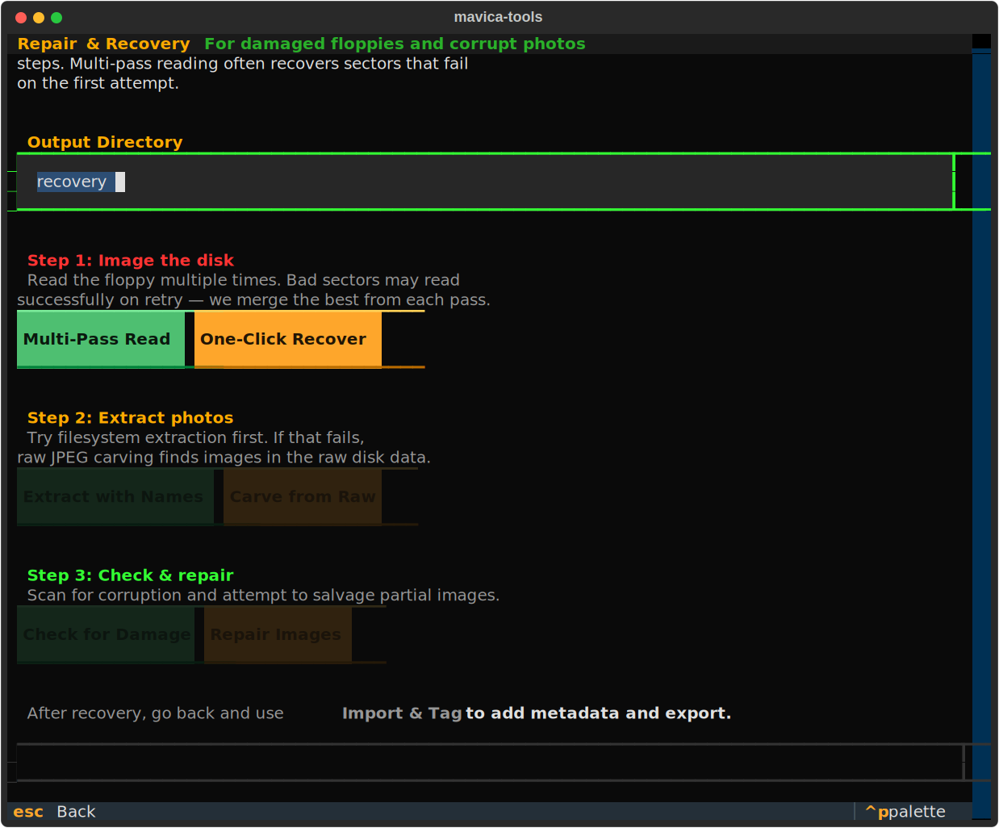
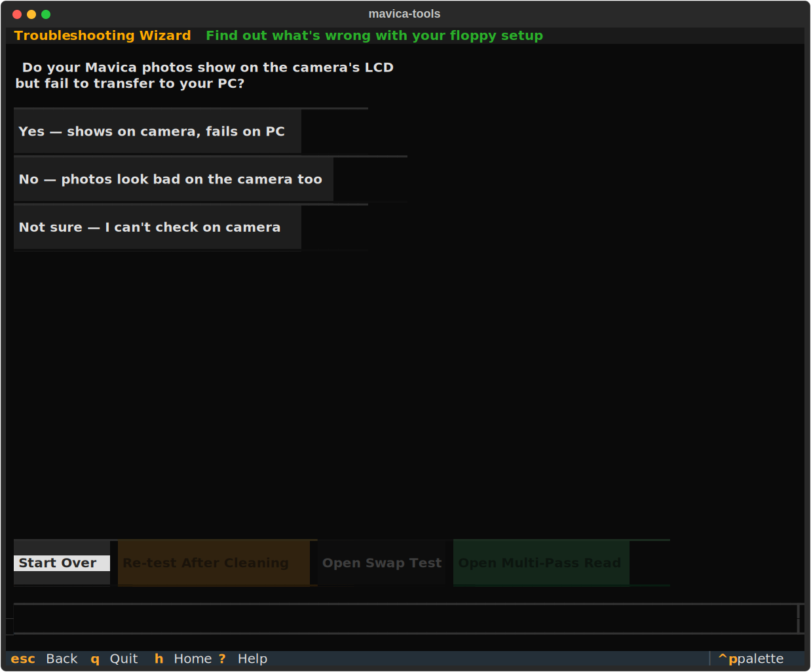
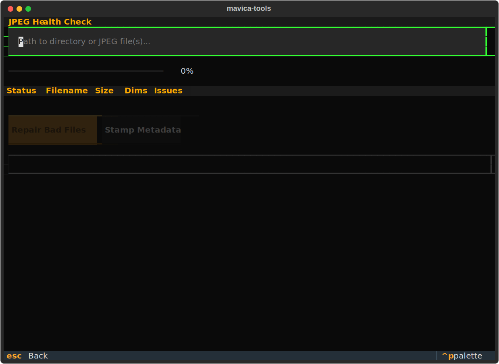
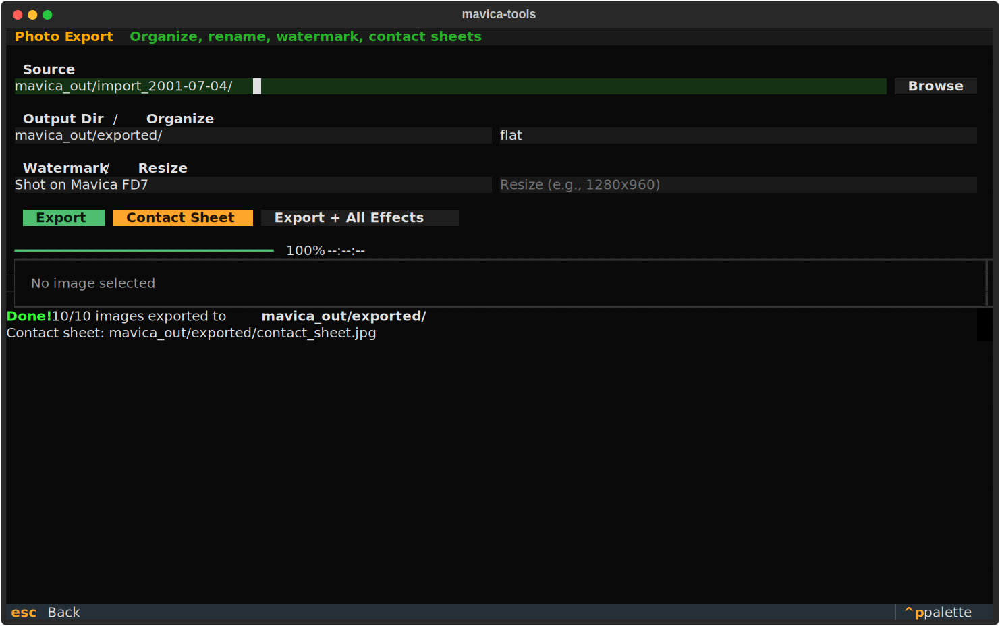

# mavica-tools

Floppy disk recovery and troubleshooting toolkit for Sony Mavica cameras.

Works on **Windows**, **macOS**, and **Linux**.


## Install

```bash
# Using uv (recommended)
uv sync

# Or with pip
pip install -e .

# Optional: GPS track merging (adds piexif dependency)
pip install -e ".[gps]"
```

## Quick Start

The fastest way to recover images from a Mavica floppy:

```bash
# Option 1: Interactive TUI (recommended)
mavica tui

# Option 2: One command does everything
mavica recover images my_disk.img -o recovery/

# Option 3: Step by step
mavica multipass read /dev/fd0 -n 5 -o my_disk    # read floppy
mavica fat12 extract my_disk/merged.img            # extract with original names
mavica check extracted/                             # find corrupt files
mavica repair extracted/ -o repaired/               # fix corrupt files
mavica stamp repaired/ -m fd7 -d auto              # add camera/date metadata
mavica report recovery/ --label "Beach Trip 2001"  # generate HTML report
```

## Interactive TUI

```bash
mavica tui
```

The TUI has 14 screens organized by workflow stage:

**Start Here:**
- **Guided Recovery** — 8-step walkthrough from floppy read to export
- **One-Click Recover** — full pipeline in one command
- **Troubleshoot** — interactive wizard to diagnose floppy problems

**Recovery Steps:**
- **Read Floppy** — multi-pass imager with visual sector map
- **Extract with Names** — recover files with original Mavica names
- **Carve from Raw** — extract JPEGs from damaged disk images
- **Check for Damage** — batch corruption scanner
- **Repair** — salvage pixels from corrupt files

**Post-Processing:**
- **Add Photo Info** — stamp camera model, focal length, and date into EXIF
- **Add GPS Location** — match photos to GPS tracks
- **Export & Share** — organize, contact sheets, watermarks

**Diagnostic:**
- **Camera Swap Test** — isolate faulty hardware
- **Format Floppy** — create Mavica-compatible disks

<details>
<summary>TUI screenshots</summary>

**Import from Floppy** — regular use: read, tag, export


**Repair & Recovery** — damaged disk workflow


**Troubleshooting Wizard** — interactive diagnostic


**Multipass Read** — sector map and progress


**JPEG Health Check** — corruption scanner


**Photo Export** — contact sheets, watermarks


**GPS Track Merge** — match photos to GPS data


**Swap Test** — camera/disk test matrix


</details>

## CLI Reference

All tools work standalone from the command line.

### Recovery Tools

#### `mavica multipass` — Multi-pass floppy imager

Reads a floppy multiple times and merges the best sectors. Floppy reads are non-deterministic — a sector that fails on pass 1 may succeed on pass 3.

```bash
# Linux
mavica multipass read /dev/fd0 -n 5 -o my_disk

# Windows (run as Administrator)
mavica multipass read \\.\A: -n 5 -o my_disk

# macOS
mavica multipass read /dev/disk2 -n 5 -o my_disk

# Merge existing images (any platform)
mavica multipass merge pass*.img -o merged.img
```

Outputs a merged image plus a visual sector health map showing which sectors were recovered.

#### `mavica fat12` — FAT12 filesystem tools

Read the Mavica's actual filesystem to recover original filenames (MVC-001.JPG, etc). Can also recover deleted files.

```bash
mavica fat12 ls disk.img                # list files with dates and sizes
mavica fat12 ls disk.img --deleted      # include deleted files
mavica fat12 extract disk.img -o out/   # extract with original names
mavica fat12 extract disk.img --deleted # include deleted files
```

Deleted Mavica files are reconstructed: the erased first byte is restored as `M` (for MVC-*.JPG).

#### `mavica carve` — JPEG carver

Extracts JPEG images directly from raw disk images by scanning for JPEG markers. Bypasses the filesystem entirely — works even when FAT is completely trashed.

```bash
mavica carve my_disk/merged.img -o recovered/
```

#### `mavica recover` — Full recovery pipeline

Runs everything in one command: merge passes → try FAT12 extraction → fall back to carving → check → repair.

```bash
# From disk images
mavica recover images pass_01.img pass_02.img -o recovery/

# From a floppy device
mavica recover device /dev/fd0 -o recovery/ -n 5

# Skip FAT12, go straight to carving
mavica recover images disk.img --no-fat -o recovery/
```

### Diagnostic Tools

#### `mavica check` — JPEG health checker

Batch-checks JPEGs for corruption: truncation, zero-byte runs (sector read failures), missing markers.

```bash
mavica check /mnt/floppy/          # check all JPEGs in a directory
mavica check *.jpg -v              # verbose — show OK files too
```

Detects:
- Missing SOI/EOI markers
- Zero-byte runs (failed sectors, typically 512+ bytes of zeros)
- Truncated files
- Pillow decode failures

#### `mavica swaptest` — Cross-camera test tracker

Systematically test multiple cameras and disks to isolate which component is faulty.

```bash
mavica swaptest setup --cameras "FD7-A,FD7-B,FD88" --disks "Disk-1,Disk-2,Disk-3"
mavica swaptest log --camera FD7-A --disk Disk-1 --result ok
mavica swaptest log --camera FD7-A --disk Disk-2 --result fail
mavica swaptest status     # see what's left to test
mavica swaptest report     # analyze and find the culprit
```

The report identifies patterns:
- All disks fail with one camera → bad write head (clean with 99% IPA)
- All cameras fail with one disk → bad disk (replace it)
- Single combo fails → head alignment mismatch

#### `mavica detect` — Floppy drive detection

Auto-detect available floppy drives on your system.

```bash
mavica detect
```

Scans Linux `/sys/block` + `/dev/fd*`, Windows WMI, macOS `diskutil`.

#### `mavica history` — Disk health tracking

Track sector health over time to detect degrading disks.

```bash
mavica history record "TDK-001" merged.img          # save a snapshot
mavica history record "TDK-001" merged.img --notes "after cleaning"
mavica history view TDK-001                          # see health over time
mavica history view                                  # list all tracked disks
mavica history compare TDK-001                       # first vs latest snapshot
```

### Post-Recovery Tools

#### `mavica repair` — JPEG repair

Salvages readable pixels from corrupt/truncated JPEGs. Outputs PNG files.

```bash
mavica repair corrupt_image.jpg                 # repair one file
mavica repair recovered/ -o repaired/           # repair all in directory
```

Three strategies tried in order:
1. Pillow truncation tolerance (handles most cases)
2. Sector failure detection — finds large zero-byte runs and truncates before them
3. Progressive tail trimming — removes corrupt data from the end

#### `mavica stamp` — EXIF metadata stamper

Mavica cameras write bare JFIF JPEGs with no EXIF. This tool adds metadata.

```bash
# Add camera model and auto-date from file timestamp
mavica stamp recovered/ -m fd7 -d auto

# Add specific date
mavica stamp photo.jpg -m fd88 -d "2001-07-04" --description "4th of July"

# Overwrite originals instead of creating _stamped copies
mavica stamp photos/ -m fd7 -d auto --overwrite
```

Model shorthands: `fd5`, `fd7`, `fd51`, `fd71`, `fd73`, `fd75`, `fd83`, `fd85`, `fd87`, `fd88`, `fd90`, `fd91`, `fd92`, `fd95`, `fd97`, `fd100`, `fd200`

All resolve to full names like "Sony Mavica MVC-FD7".

#### `mavica format` — Floppy formatter

Create Mavica-compatible FAT12 disk images or format physical floppies.

```bash
mavica format image -o blank.img -l "MAVICA"         # create image file
mavica format device /dev/fd0 -l "MAVICA"             # format physical floppy
mavica format device \\.\A: -l "MAVICA" -y            # Windows, skip confirmation
```

#### `mavica report` — HTML recovery report

Generate a self-contained HTML report with sector maps, file lists, and inline image thumbnails.

```bash
mavica report recovery/ --label "TDK-001" --camera "Sony Mavica FD7"
mavica report recovery/ -o my_report.html --notes "Beach trip 2001"
```

The report uses a retro green-on-black terminal theme and embeds everything — no external dependencies needed to view it.

## Platform Support

| Feature | Windows | macOS | Linux |
|---------|---------|-------|-------|
| TUI | Yes | Yes | Yes |
| All CLI tools | Yes | Yes | Yes |
| Multipass device read | `\\.\A:` (Admin) | `/dev/diskN` | `/dev/fd0` |
| Drive auto-detection | WMI / PowerShell | `diskutil` | `/sys/block` |
| Format device | `\\.\A:` (Admin) | `dd` | `dd` |

## Troubleshooting Your Mavica

See [mavica-floppy-troubleshooting.md](mavica-floppy-troubleshooting.md) for a detailed guide covering:

- How to tell if it's the camera, disk, or PC drive
- Head cleaning procedures
- Cross-camera swap test methodology
- Floppy disk maintenance and storage

## Development

```bash
uv sync --extra dev                     # install with test deps
uv run pytest -v                        # run all 160 tests
uv run pytest -k "not tui" -v           # fast unit tests (~1s)
uv run pytest tests/test_tui.py -v      # TUI tests (~13s)
```

See [AGENTS.md](AGENTS.md) for architecture, function signatures, and conventions.

## Requirements

- Python 3.10+
- [Pillow](https://pillow.readthedocs.io/) (image decoding + EXIF)
- [Textual](https://textual.textualize.io/) (terminal UI)
- [piexif](https://piexif.readthedocs.io/) (optional — GPS track merging only, install with `pip install mavica-tools[gps]`)
- [uv](https://docs.astral.sh/uv/) (recommended package manager)
